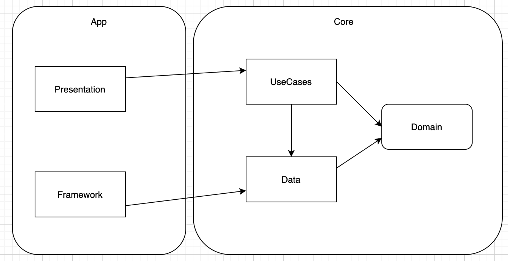

# Forecast Application

## Project's Architecture Approaching 

- 

- 

- The scope of this is small, It's just display the forecast of the current searching city, but it can be scaled bigger so Clean Architecture and MVVM is good choice for this

- The `Domain` layer 
    * Contain business models
- The `Data` layer will take role:
    * Request remote data by use retrofit 
    * Receive the `Caching` dependency from `Framework layer` 
    * The Open repository loads data (in flow data) from `Caching` if it available, if not, it fetch remote data and caches by `Caching`
    * Maps the data model to the business model from domain
- The `UseCases` layer will take role:
    * Handles user's interaction logic: query 7 days forecast from current time, using celsius unit
    * Depend on Data layer's Interface (Here is IOpenWeather repository, the concrete class OpenWeather only available in data layer)
    * Doesn't relate to UI layer
 - The `Framework` layer will take role:
    * Implement Caching abstraction from `Data` by using Android Room 
 - The `Presentation` layer: apply `MVVM` architecture 
    * MainActivity's implementing IMainView
    * ViewModel Handle data was taken from UseCases layer, publish the data stream, notify observer to change the UI
    * The Observer of ViewModel's taking the IMainView interface as dependency, show it's testable
 - Dependencies Injection's handled by using Dagger
    - `DataComponents` will provides/bind the dependencies instance which are supported in graph,they're `NetworkModule`, `OpenWeatherModule`, `DatabaseModule` of data layer. It's taking the `Context` as itself dependency
    - `UseCasesComponents` will provides/bind the dependencies instance which are supported in graph,it's `UseCasesModule`  of data layer. It's taking `IOpenWeather` as its dependency
    - `FrameworkComponents` will bind the implementation of `Caching` abstraction from `Data` layer
    - `AppComponents`  will provides/bind the dependencies instance which are supported in graph,they're `CommonMudule`, `ViewModelModules`  of data layer. It's taking `IOpenWeatherUseCases` and `Context` as its dependency
    - `ForecastApplication` ints and links all of Components, it will be the Dependencies Holder `DependenciesProvider` and provide Injector `InjectionProvider`
    
## Project code structure
 - Project structure
  1. Contains 4 modules:
    - domain: Domain layer
    - data: Data layer
    - usecases: Usecases layer
    - utilities: Utilities for project
   2. App:
    - Resources
    - `framework` package: framework layer
    - `presentation` package: presentation layer
    - `ForecastApplication`'s holding dependencies from layers, be a Dependencies Holder and Injector
 
## Install
- Run app adhoc from Android studio
- Or install this [latest](https://github.com/khiemle/forecast/blob/master/app/builds/release/app-release.apk) build, which I generated by signed with [keystore](https://github.com/khiemle/forecast/blob/master/nab)

## Checklist

1. Programming language: Kotlin is required, Java is optional. ✅ 
2. Design app's architecture (suggest MVVM) ✅ 
3. Apply LiveData mechanism ✅ 
4. UI should be looks like in attachment. ✅ 
5. Write UnitTests ✅ 

Unit test result for
- Data layer

[OpenWeatherErrorParser test](https://github.com/khiemle/forecast/blob/master/app/data/src/test/java/com/khiemle/data/repositories/OpenWeatherErrorParserTest.kt)
[OpenWeather test](https://github.com/khiemle/forecast/blob/master/app/data/src/test/java/com/khiemle/data/repositories/OpenWeatherTest.kt)

- UseCases layer

[OpenWeatherUseCases test](https://github.com/khiemle/forecast/blob/master/app/usecases/src/test/java/com/khiemle/usecases/usecases/OpenWeatherUseCasesTest.kt)

- Framework layer

[ForecastDatabase test](https://github.com/khiemle/forecast/blob/master/app/src/androidTest/java/com/khiemle/nab/framework/room/ForecastDatabaseTest.kt)

- Presentation layer and app

[MainObserver test](https://github.com/khiemle/forecast/blob/master/app/src/test/java/com/khiemle/nab/MainObserverTest.kt)
[MainViewModel test](https://github.com/khiemle/forecast/blob/master/app/src/test/java/com/khiemle/nab/MainViewModelTest.kt)

6. Acceptance Tests
7. Exception handling ✅ 
8. Caching handling ✅ 
9. Secure Android app from:
  * Decompile APK
  * Rooted device ✅ 
  * Data transmission via network ✅ 
  
    - [Adding Certificate Pinning to OkHttp client](https://github.com/khiemle/forecast/blob/master/app/data/src/main/java/com/khiemle/data/deps/NetworkModule.kt#L57)
    - Save all pin certificates in [env.properties](https://github.com/khiemle/forecast/blob/master/app/data/env.properties), It gonna be generated by Secure Build Pipeline for each environment (prod or test)
    - Generate string resources by data layer [build.gradle](https://github.com/khiemle/forecast/blob/master/app/data/build.gradle.kts#L31) file       
   
  * Encryption for sensitive information
10. Accessibility for Disability Supports:
  * Talkback: Use a screen reader.✅ 
  * Scaling Text: Display size and font size: To change the size of items on your screen,
  adjust the display size or font size.✅ 
11. Entity relationship diagram for the database and solution diagrams for the
components, infrastructure design if any ✅ 
12. Readme file includes: ✅ 
  * Brief explanation for the software development principles, patterns & practices being
  applied
  * Brief explanation for the code folder structure and the key Java/Kotlin libraries and
  frameworks being used
  * All the required steps in order to get the application run on local computer
  * Checklist of items the candidate has done.

