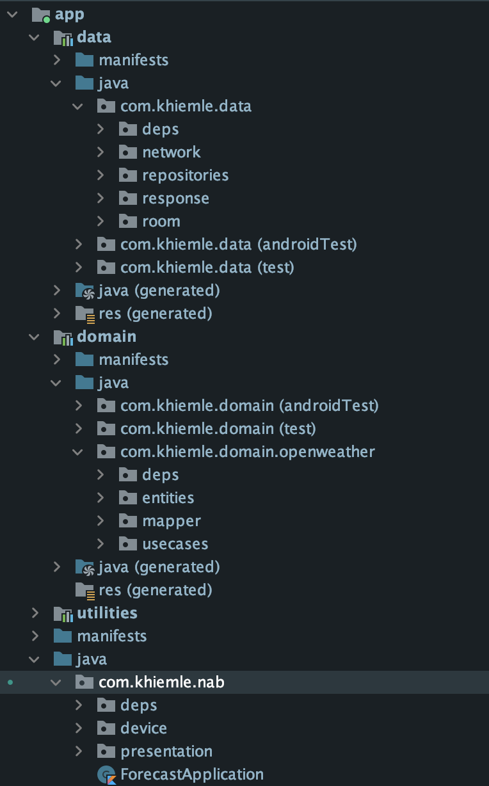

# Forecast Application

## Project's Architecture Approaching

- The scope of this is small, It's just display the forecast of the current searching city, but it can be scaled bigger so MVVM is good choice for this
- The data layer will take role:
    * Request remote data by use retrofit 
    * Caching the remote data to Room database
    * The Open repository loads data (in flow data) from SQLite if it available, if not, it fetch remote data and caches to SQLite by Room
    * Doesn't relate to domain layer
- The domain layer will take role:
    * Handles business logic. The business logic here are: query 7 days forecast from current time, using celsius unit
    * Maps the data from data layer to the Entity which gonna use by business logic (Here is the display purpose in UI)
    * Depend on Data layer's Interface (Here is IOpenWeather repository, the concrete class OpenWeather only available in data layer)
    * Doesn't relate to UI layer
 - The presentation layer:
    * MainActivity's implementing IMainView
    * ViewModel Handle data was taken from domain layer, publish the data stream, notify observer to change the UI
    * The Observer of ViewModel's taking the IMainView interface as dependency, show it's testable
 - Dependencies Injection's handled by using Dagger
    - DataComponents will provides/bind the dependencies instance which are supported in graph,they're `NetworkModule`, `OpenWeatherModule`, `DatabaseModule` of data layer. It's taking the `Context` as itself dependency
    - DomainComponents will provides/bind the dependencies instance which are supported in graph,it's `DomainUseCasesModule`  of data layer. It's taking `IOpenWeather` as its dependency
    - AppComponents  will provides/bind the dependencies instance which are supported in graph,they're `CommonMudule`, `ViewModelModules`  of data layer. It's taking `IOpenWeatherUseCases` and `Context` as its dependency
    - `ForecastApplication` ints and links all of Components, it will be the Dependencies Holder `DependenciesProvider` and provide Injector `InjectionProvider`
    
## Project code structure
 - Project structure
 - 
 
 
## Install
- Run app adhoc from Android studio
- Or install this [latest](https://github.com/khiemle/forecast/blob/master/app/builds/release/app-release.apk) build, which I generated by signed with [keystore](https://github.com/khiemle/forecast/blob/master/nab)

## Checklist

1. Programming language: Kotlin is required, Java is optional. ✅ 
2. Design app's architecture (suggest MVVM) ✅ 
3. Apply LiveData mechanism ✅ 
4. UI should be looks like in attachment. ✅ 
5. Write UnitTests ✅ 

Unit test result for
- Data layer

[OpenWeatherErrorParser test](https://github.com/khiemle/forecast/blob/master/app/data/src/test/java/com/khiemle/data/repositories/OpenWeatherErrorParserTest.kt)
[OpenWeather test](https://github.com/khiemle/forecast/blob/master/app/data/src/test/java/com/khiemle/data/repositories/OpenWeatherTest.kt)
[ForecastDatabase test](https://github.com/khiemle/forecast/blob/master/app/data/src/androidTest/java/com/khiemle/data/room/ForecastDatabaseTest.kt)

- Domain layer

[OpenWeatherUseCases test](https://github.com/khiemle/forecast/blob/master/app/domain/src/test/java/com/khiemle/domain/usecases/OpenWeatherUseCasesTest.kt)

- Presentation layer and app

[MainObserver test](https://github.com/khiemle/forecast/blob/master/app/src/test/java/com/khiemle/nab/MainObserverTest.kt)
[MainViewModel test](https://github.com/khiemle/forecast/blob/master/app/src/test/java/com/khiemle/nab/MainViewModelTest.kt)

6. Acceptance Tests
7. Exception handling ✅ 
8. Caching handling ✅ 
9. Secure Android app from:
  * Decompile APK
  * Rooted device ✅ 
  * Data transmission via network ✅ 
  
    - [Adding Certificate Pinning to OkHttp client](https://github.com/khiemle/forecast/blob/master/app/data/src/main/java/com/khiemle/data/deps/NetworkModule.kt#L57)
    - Save all pin certificates in [env.properties](https://github.com/khiemle/forecast/blob/master/app/data/env.properties), It gonna be generated by Secure Build Pipeline for each environment (prod or test)
    - Generate string resources by data layer [build.gradle](https://github.com/khiemle/forecast/blob/master/app/data/build.gradle.kts#L31) file       
   
  * Encryption for sensitive information
10. Accessibility for Disability Supports:
  * Talkback: Use a screen reader.✅ 
  * Scaling Text: Display size and font size: To change the size of items on your screen,
  adjust the display size or font size.✅ 
11. Entity relationship diagram for the database and solution diagrams for the
components, infrastructure design if any ✅ 
12. Readme file includes: ✅ 
  * Brief explanation for the software development principles, patterns & practices being
  applied
  * Brief explanation for the code folder structure and the key Java/Kotlin libraries and
  frameworks being used
  * All the required steps in order to get the application run on local computer
  * Checklist of items the candidate has done.

