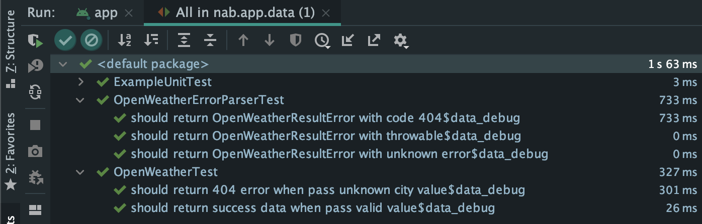

# Forecast Application

## Project's Architecture Approaching

## Project code structure

## Install

## Checklist

1. Programming language: Kotlin is required, Java is optional. ✅ 
2. Design app's architecture (suggest MVVM) ✅ 
3. Apply LiveData mechanism ✅ 
4. UI should be looks like in attachment. ✅ 
5. Write UnitTests ✅ 

Unit test result for
- Data layer

- Domain layer

- Presentation layer and app

6. Acceptance Tests
7. Exception handling ✅ 
8. Caching handling ✅ 
9. Secure Android app from:
  * Decompile APK
  * Rooted device ✅ 
  * Data transmission via network ✅ 
  * Encryption for sensitive information
10. Accessibility for Disability Supports:
  * Talkback: Use a screen reader.✅ 
  * Scaling Text: Display size and font size: To change the size of items on your screen,
  adjust the display size or font size.✅ 
11. Entity relationship diagram for the database and solution diagrams for the
components, infrastructure design if any ✅ 
12. Readme file includes: ✅ 
  * Brief explanation for the software development principles, patterns & practices being
  applied
  * Brief explanation for the code folder structure and the key Java/Kotlin libraries and
  frameworks being used
  * All the required steps in order to get the application run on local computer
  * Checklist of items the candidate has done.

